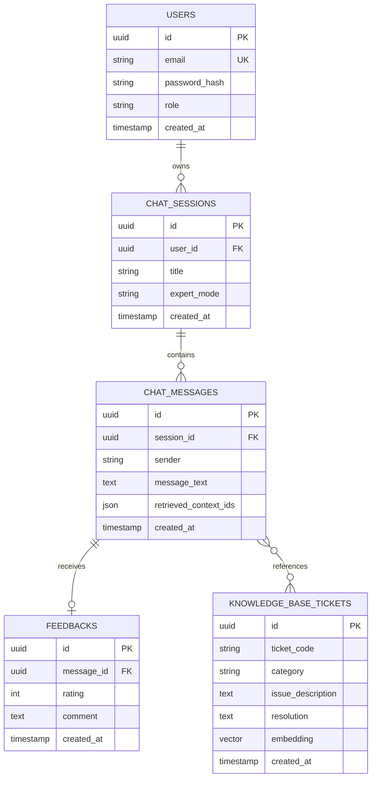
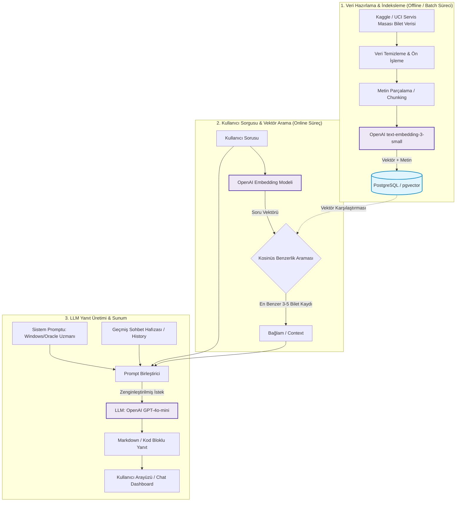

# Akıllı Servis Masası Chatbot

# ER DİYAGRAMI

```mermaid
erDiagram
    USERS ||--o{ CHAT_SESSIONS : "owns"
    CHAT_SESSIONS ||--o{ CHAT_MESSAGES : "contains"
    CHAT_MESSAGES ||--o| FEEDBACKS : "receives"
    CHAT_MESSAGES }o--o{ KNOWLEDGE_BASE_TICKETS : "references"

    USERS {
        uuid id PK
        string email UK
        string password_hash
        string role
        timestamp created_at
    }

    CHAT_SESSIONS {
        uuid id PK
        uuid user_id FK
        string title
        string expert_mode
        timestamp created_at
    }

    CHAT_MESSAGES {
        uuid id PK
        uuid session_id FK
        string sender
        text message_text
        json retrieved_context_ids
        timestamp created_at
    }

    FEEDBACKS {
        uuid id PK
        uuid message_id FK
        int rating
        text comment
        timestamp created_at
    }

    KNOWLEDGE_BASE_TICKETS {
        uuid id PK
        string ticket_code
        string category
        text issue_description
        text resolution
        vector embedding
        timestamp created_at
    }
```
## RAG (Retrieval-Augmented Generation) Akış Diyagramı

```mermaid
flowchart TD
    %% Alt Süreç 1: Veri Hazırlama ve İndeksleme
    subgraph INDEXING["1. Veri Hazırlama & İndeksleme (Offline / Batch Süreci)"]
        A[Kaggle / UCI Servis Masası Bilet Verisi] --> B[Veri Temizleme & Ön İşleme]
        B --> C[Metin Parçalama / Chunking]
        C --> D[OpenAI text-embedding-3-small]
        D -->|Vektör + Metin| E[(PostgreSQL / pgvector)]
    end

    %% Alt Süreç 2: Canlı Soru ve Arama Süreci
    subgraph QUERY["2. Kullanıcı Sorgusu & Vektör Arama (Online Süreç)"]
        U[Kullanıcı Sorusu] --> F[OpenAI Embedding Modeli]
        F -->|Soru Vektörü| G{Kosinüs Benzerlik Araması}
        E -.->|Vektör Karşılaştırması| G
        G -->|En Benzer 3-5 Bilet Kaydı| H[Bağlam / Context]
    end

    %% Alt Süreç 3: Yanıt Üretimi ve Çıktı
    subgraph GENERATION["3. LLM Yanıt Üretimi & Sunum"]
        SP[Sistem Promptu: Windows/Oracle Uzmanı] --> I[Prompt Birleştirici]
        H --> I
        U --> I
        CH[Geçmiş Sohbet Hafızası / History] --> I
        I -->|Zenginleştirilmiş İstek| J[LLM: OpenAI GPT-4o-mini]
        J --> K[Markdown / Kod Bloklu Yanıt]
        K --> L[Kullanıcı Arayüzü / Chat Dashboard]
    end

    %% Stiller
    classDef process fill:#f9f9f9,stroke:#333,stroke-width:1px;
    classDef db fill:#e1f5fe,stroke:#0288d1,stroke-width:2px;
    classDef llm fill:#ede7f6,stroke:#512da8,stroke-width:2px;
    
    class E db;
    class D,F,J llm;
```