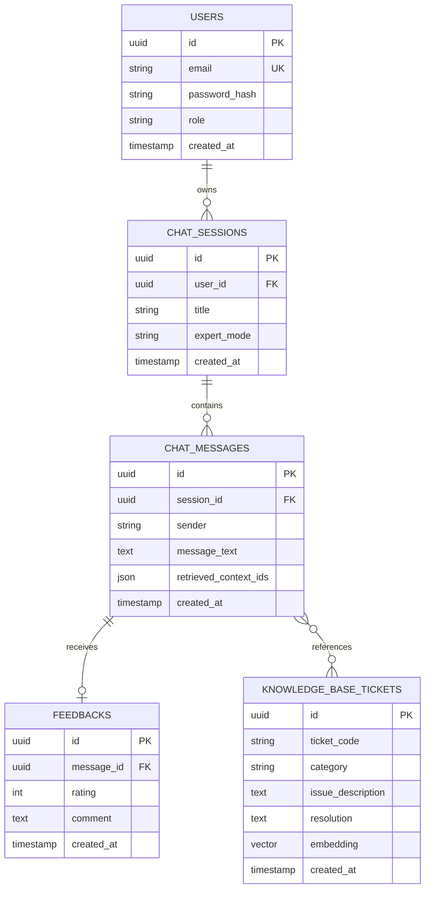
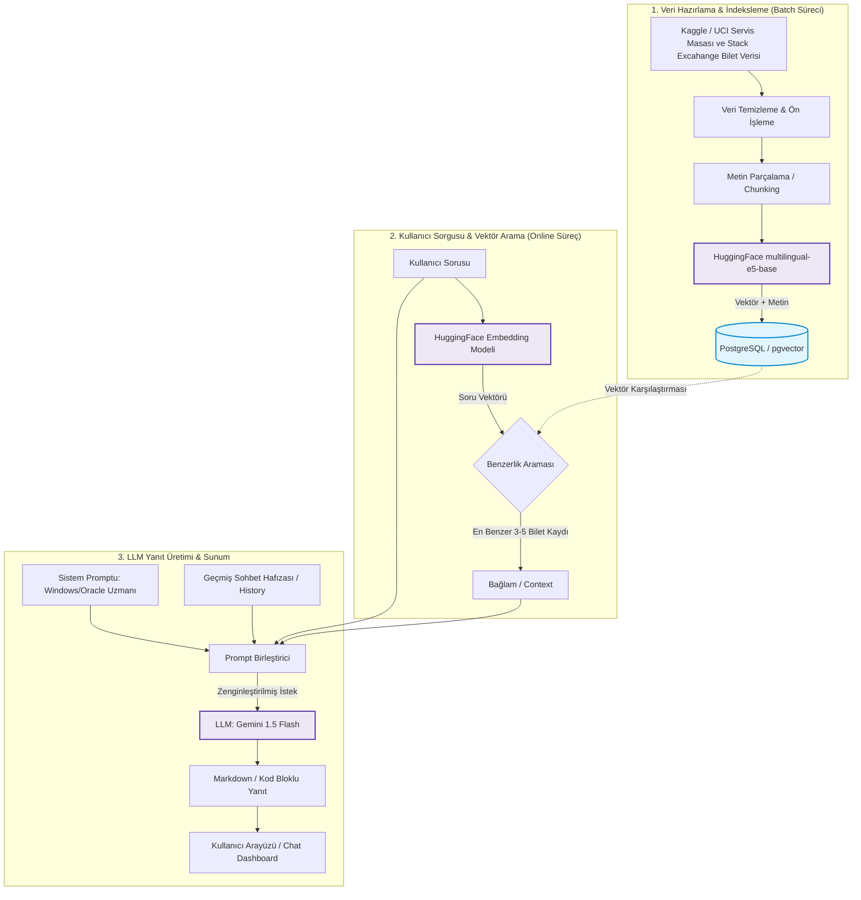

# Akıllı Servis Masası Chatbot

# ER DİYAGRAMI

```mermaid
erDiagram
    USERS ||--o{ CHAT_SESSIONS : "owns"
    CHAT_SESSIONS ||--o{ CHAT_MESSAGES : "contains"
    CHAT_MESSAGES ||--o| FEEDBACKS : "receives"
    CHAT_MESSAGES }o--o{ KNOWLEDGE_BASE_TICKETS : "references"

    USERS {
        uuid id PK
        string email UK
        string password_hash
        string role
        timestamp created_at
    }

    CHAT_SESSIONS {
        uuid id PK
        uuid user_id FK
        string title
        string expert_mode
        timestamp created_at
    }

    CHAT_MESSAGES {
        uuid id PK
        uuid session_id FK
        string sender
        text message_text
        json retrieved_context_ids
        timestamp created_at
    }

    FEEDBACKS {
        uuid id PK
        uuid message_id FK
        int rating
        text comment
        timestamp created_at
    }

    KNOWLEDGE_BASE_TICKETS {
        uuid id PK
        string ticket_code
        string category
        text issue_description
        text resolution
        vector embedding
        timestamp created_at
    }
```

# RAG DİYAGRAMI

```mermaid
flowchart TB
    %% 1. ve 2. Süreç: Yan Yana Üst Bloklar
    subgraph S1 ["1. Veri Hazırlama & İndeksleme (Batch Süreci)"]
        A[Kaggle / UCI Servis Masası ve Stack Excahange Bilet Verisi] --> B[Veri Temizleme & Ön İşleme]
        B --> C[Metin Parçalama / Chunking]
        C --> D[HuggingFace multilingual-e5-base]
        D -->|Vektör + Metin| E[(PostgreSQL / pgvector)]
    end

    subgraph S2 ["2. Kullanıcı Sorgusu & Vektör Arama (Online Süreç)"]
        U[Kullanıcı Sorusu] --> F[HuggingFace Embedding Modeli]
        F -->|Soru Vektörü| G{Benzerlik Araması}
        G -->|En Benzer 3-5 Bilet Kaydı| H[Bağlam / Context]
    end

    %% S1 ve S2'nin yan yana durmasını sağlayan görünmez yatay bağ
    S1 ~~~ S2

    %% 1 ve 2 arasındaki dinamik veri köprüsü
    E -.->|Vektör Karşılaştırması| G

    %% 3. Süreç: Alt Katman (Yanıt Üretimi)
    subgraph S3 ["3. LLM Yanıt Üretimi & Sunum"]
        SP[Sistem Promptu: Windows/Oracle Uzmanı] --> I[Prompt Birleştirici]
        CH[Geçmiş Sohbet Hafızası / History] --> I
        I -->|Zenginleştirilmiş İstek| J[LLM: Gemini 1.5 Flash]
        J --> K[Markdown / Kod Bloklu Yanıt]
        K --> L[Kullanıcı Arayüzü / Chat Dashboard]
    end

    %% Üst Süreçlerden Alt Süreçteki Prompt Birleştiriciye Giden Orijinal Bağlantılar
    H --> I
    U --> I

    %% Görsel Stiller
    classDef db fill:#e1f5fe,stroke:#0288d1,stroke-width:2px;
    classDef llm fill:#ede7f6,stroke:#512da8,stroke-width:2px;

    class E db;
    class D,F,J llm;
```
